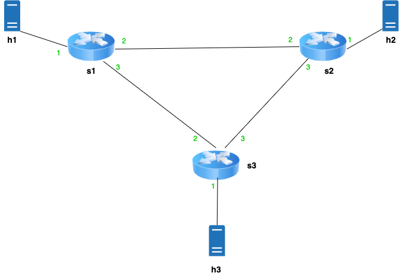
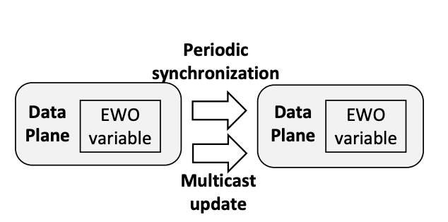

## Topology:

## high-level overview of the replication protocol

Each switch contains a CMS (consisting of 3 registers) for tracking local updates, as well as one sketch per switch in the topology.
There is also a register called "packet_count" on each switch, which is used to track the number of received packets.
When a packet is received from the host (on port 1), it is added to the local sketch, and the packet counter is incremented. if the counter reaches the pre-defined batch size, the local sketch will be synchronized between switches.
The synchronization protocol clones and recirculates the cloned TCP packet and changes it to a replication packet (called update packet) which will be used to multicast the local CMS index by index to other switches.
each update packet contains an index and the 3 corresponding values for each register in the sketch.
Since the sketch is a CRDT(?) G-Counter (Grow-only Counter), each switch takes the maximum of the current value in the register and the value in the received update packet so older updates will not rewrite the sketch.

There is also a script called "probe.py", which will send a "probe" packet from the host to the switch. the switch then adds up all sketches and sends them back to the host index by index. (the receive.py script should be running as well)

