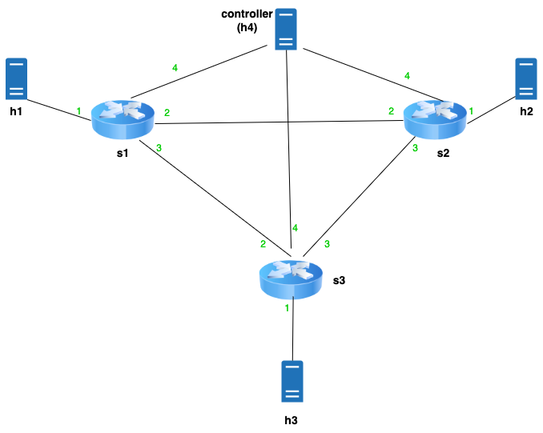

## Topology:

## high-level overview of the replication protocol

## Brief Explanation:
Each switch contains a sketch (consisting of 3 registers) for tracking local updates, as well as one sketch for each switch in the topology. Additionally, each switch keeps track of the current window, the total number of acknowledgments and updates received from other switches in the current window. The assumption here is that the replication (update) packets are never dropped, therefore to advance the window we only check if these match the number of switches in the network. Alternatively, we can replace these registers with bitfields to track acks and updates per switch and perform error handling.
furthermore, there is one register per switch in the network that will track the number of update packets received from each switch for the current window. each switch sends the acknowledgment only after all update packets are received from that switch.
there are also 2 sketches called merge and sync, which will be explained later on.

there is one host in the network (called controller), which is connected to all switches. since it is not possible to have a timer in bmv2 software switches, this host sends an ethernet packet ( with ether type 0x1234) to other switches to initiate the window advancement procedure (timer.py). It is possible to add other timers for having a more fine-grained control over the window advancement procedure.

Upon receiving the timer packet from the controller, each switch clones and recirculates the packet, and then copies the local update sketch into the sync sketch index by index, sets the local update registers back to zero, and multicasts the updates index by index. After receiving all updates and acks from other switches, the sync sketch and the sketches for other switches are added to the merge sketch, and the window is advanced. While the window advancement procedure is in process, new updates are added to the local update sketch.