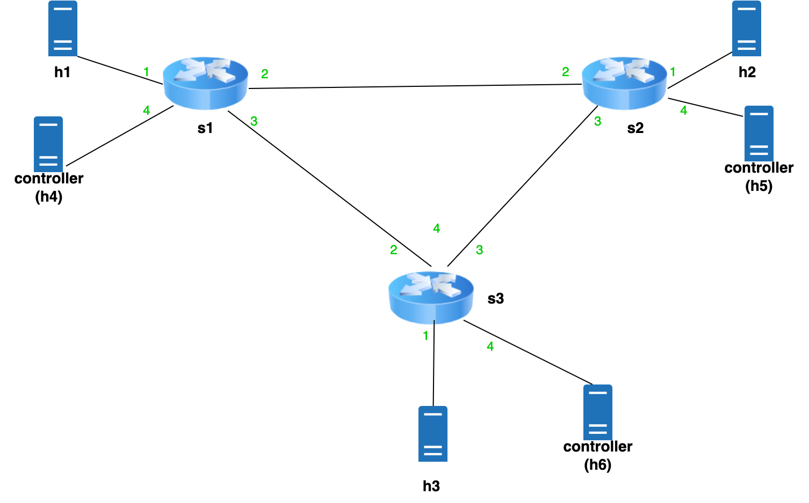

## Topology:

## Brief Explanation:
Each switch contains a CMS (consisting of 3 registers) for tracking local updates, as well as one sketch per switch in the topology. There is also a register in each switch that keeps track of the sequence number.

When a new packet is received from the host port, the switch first uses the hash functions to generate the indices associated with that flow, multicasts an update packet that includes these indices and sends the packet to the controller. 

After receiving an update, the switch will increment the indices in the sketch associated with that switch and sends back an acknowledgment. The assumption here is the packets are not dropped or duplicated. otherwise, we can simply add a register (for each switch) to keep track of the updates for each switch (update packets already contain the sequence number).

acknowledgments are sent to the controller, which after receiving all acks would send the buffered packet back to the switch to be forwarded. The switch now counts the packet in the local CMS.

There is also a script called "probe.py", which will send a "probe" packet from the host to the switch. the switch then adds up all sketches and sends them back to the host index by index. (the receive.py script should be running as well)

### note:
For this implementation, a host is used as the controller for each switch, as using the CPU port and grpc would randomly crash the virtual machine on my system. 

